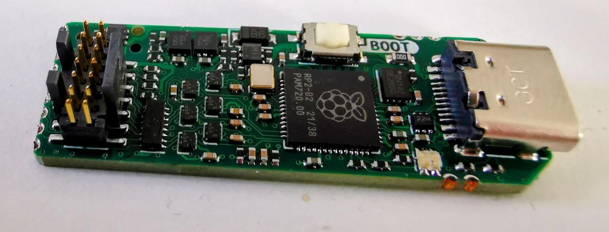

# The Rusty Probe

This is an open hardware probe for the Serial Wire Debug (SWD) and JTAG protocol.
Based on the RP2040 MCU.

## Firmware

The firmware is available here and is open-source: ...

## Features

* The output connector can either be:
    * The STDC14 connector used on STLink/V3 which is mounted by default.
    * Or the standard Cortex-M Debug (1.27mm, 10 pin) connector if one bends/removes the outer 2 pins on the connector.
* The programming connector is the Tag Connect TC2030, however for just loading firmware the USB bootloader is recommended.
* Castellated vias for all programming pins, power and 2 GPIOs.
* USB-C connector.
* Target 5V and `Vtarget` is protected with an ideal diode circuit to not have current flow from the target to the host.
* The probe support 1.8v - 3.3v signal voltage and `Vtarget`
* For compatibility (mainly with Tag-Connect TC2050), pin 7 on the STDC 14 can be connected to the protected 5V.

The schematic can be found in [the schematic PDF](rs-probe-v1.0-rev-d.pdf).

## Cable Assembly

The rs-probe package sold on our [shop](https://shop.probe.rs) contains two 16 wire ribbon cables, three 14p connectors and one 10p connector.
You can make one cable with a 14p connector on each side and one cable with a 14p connector on one and a 10p connector on the other side. How to align the connectors is explained in the image below:

## License

This work is licensed under [CERN-OHL-P](cern_ohl_p_v2.txt).
