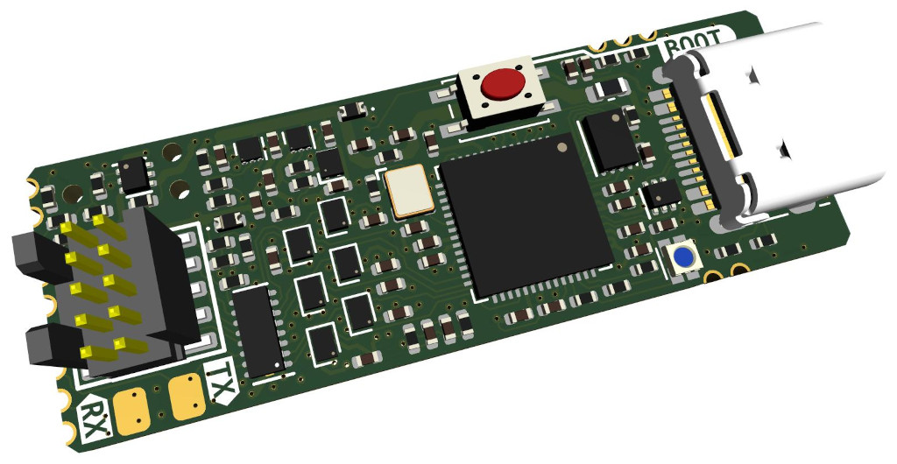

# The Rusty Probe

This is an open hardware probe for the Serial Wire Debug (SWD) and JTAG protocol.
Based on the RP2040 MCU.

## Firmware

The firmware is available [here](https://github.com/probe-rs/rusty-probe-firmware) and is open-source.

## Features

- The 10-pin Cortex-Debug connector is used.
- The programming connector is the Tag Connect TC2030, however for just loading firmware the USB bootloader is recommended.
- Castellated vias for all programming pins, power and 2 GPIOs.
- USB-C connector.
- Target 5V and `Vtarget` is protected with an diode circuit to not have current flow from the target to the host.
- The probe support 1.8v - 3.3v signal voltage and can track `Vtarget`.
- The key pin on the Cortex-Debug can be connected to the protected 5V.

The schematic can be found in the GitHub actions, full production files are generated for each commit.

## Comparison

Here is a small comparison with a few different probes:

|                         | Rusty Probe                         | PicoProbe                     | Raspberry Pi Debug Probe       | STLinkV3               | JLink                               |
|-------------------------|-------------------------------------|-------------------------------|--------------------------------|------------------------|-------------------------------------|
| Max speed               | 62 MHz                              | ?                             | 10 MHz                         | 24 MHz                 | 15 MHz                              |
| Target interface support| JTAG, SWD, SWO, UART                | SWD                           | SWD, UART                      | JTAG, SWD, UART, SWO  Note: STM8/32 chips only       | JTAG, SWD, SWO|
| IO voltage control      | 1.8-3.3V                            | 3.3V                          | 3.3V                           | 1.6-3.3V           | 1.6-3.3V somtimes  |
| Type                    | Open Source & Hardware              | Open Source                   | Proprietary                    | Proprietary        | Proprietary        |
| Language                | Rust                                | C                             | C                              | C                  | C                  |
| Protocol                | CMSIS-DAP                           | CMSIS-DAP                     | CMSIS-DAP                      | Proprietary        | CMSIS-DAP          |
| Programming connector   | Cortex-M Debug 10p                  | -                             | JST                            | Cortex-M Debug 14p | Cortex-M Debug 10p |
| USB speed               | 12 MBit/s                           | 12 MBit/s                     | 12 MBit/s                      | 480 MBit/s         | 12 MBit/s          |

## Where to buy

The probe is available in the [probe-rs shop](https://shop.probe.rs/). But you are free to build one yourself as well!

## License

This work is licensed under [CERN-OHL-P](cern_ohl_p_v2.txt).
